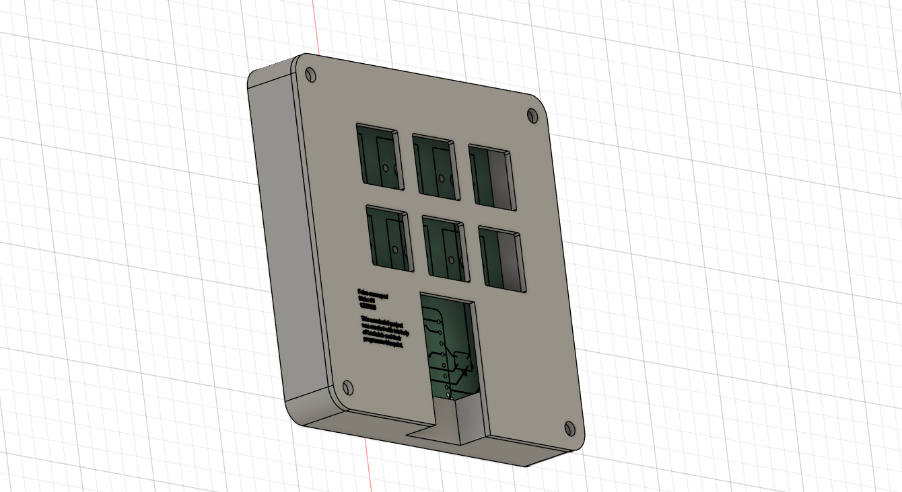
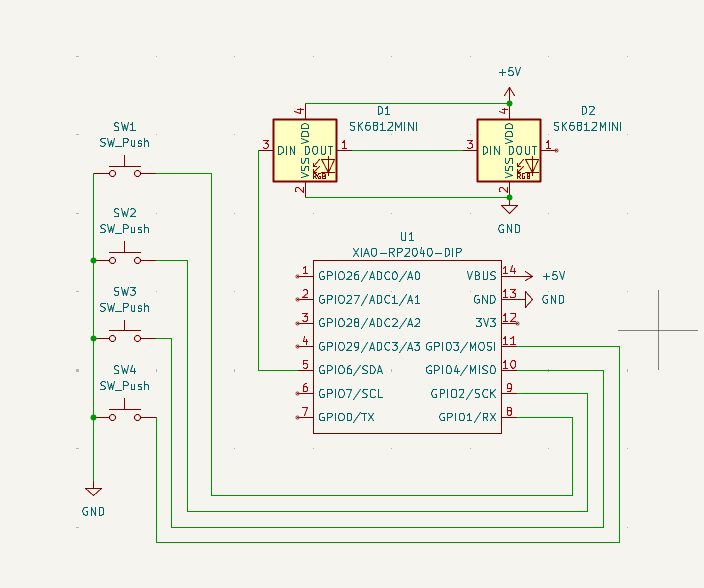
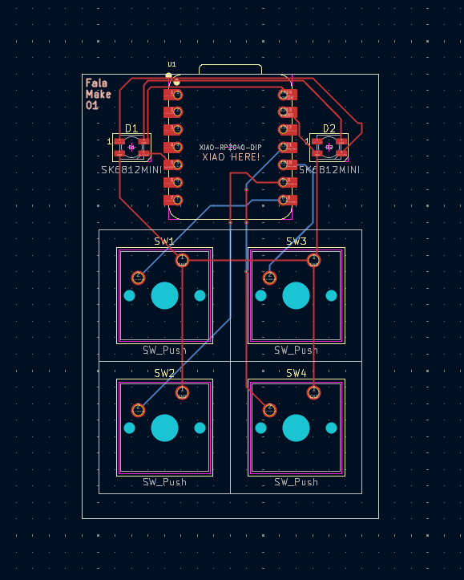
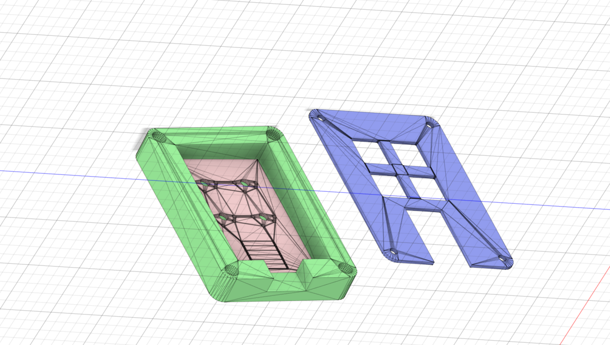

# Falas Hackpad

This is my custom Hackpad built for the Hackpad challenge.  
The idea was to keep it simple, clean, and fully custom from schematic to PCB to case.

Everything here is open and easy to understand so anyone can learn from it or build their own version.

---

## Overall Hackpad

This shows the full hackpad and how the PCB fits inside the case.

---

## Schematic

The complete schematic used for this hackpad, including the microcontroller and switch connections.

---

## PCB Layout

The PCB layout showing switch placement, routing, and overall board design.

---

## Case and Fit

This shows the case design and how all parts fit together.

---

## Bill of Materials BOM

| Part | Quantity | Notes |
|-----|----------|------|
| Microcontroller | 1 | XIAO RP2040 or compatible |
| Mechanical Switches | 4 | MX style |
| Diodes | 4 | For switch inputs |
| Custom PCB | 1 | Designed in KiCad |
| Case | 1 | 3D printed |
| USB Cable | 1 | Power and programming |

---

## Firmware

The firmware is written in CircuitPython.  
It handles key input and basic macro functionality.

You can find the firmware files inside the firmware folder.

---

## Project Structure

- PCB contains the KiCad schematic and PCB files  
- CAD contains the case design files  
- Firmware contains the CircuitPython code  
- images contains all screenshots used in this README  

---

## Notes

This project was created for the Hackpad challenge and follows open source principles.  
Feel free to fork it, improve it, or build your own version from it.

Thanks for checking it out.
